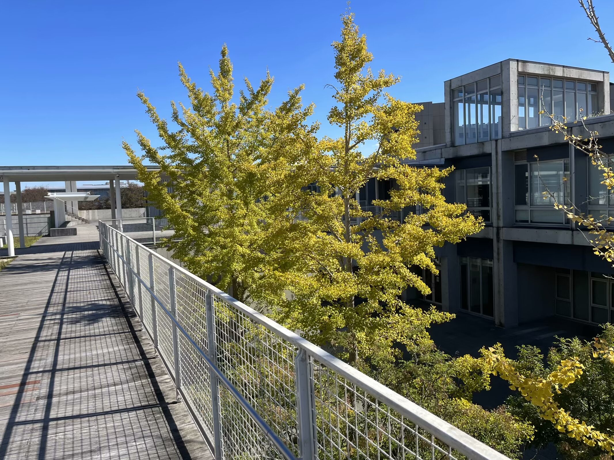
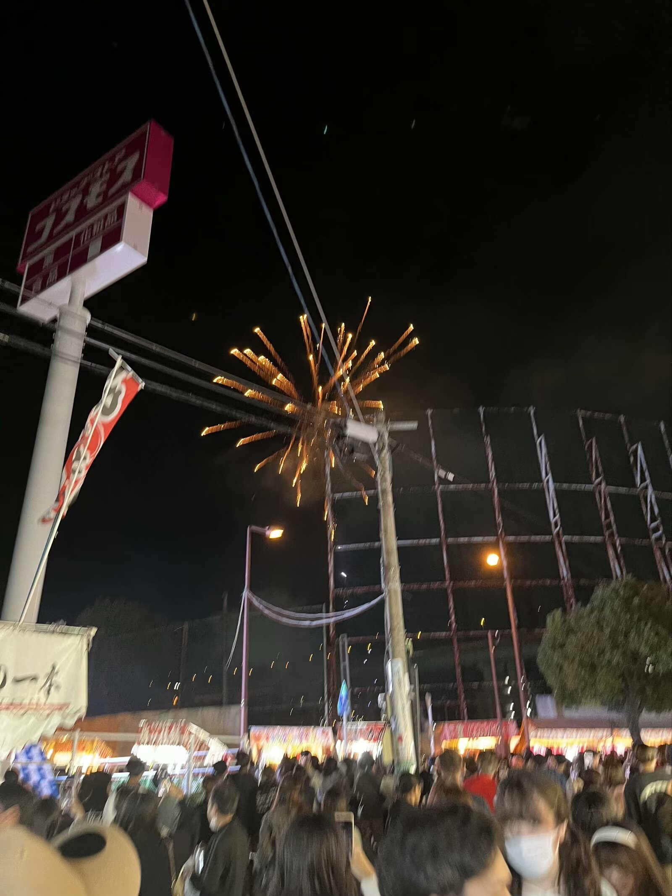
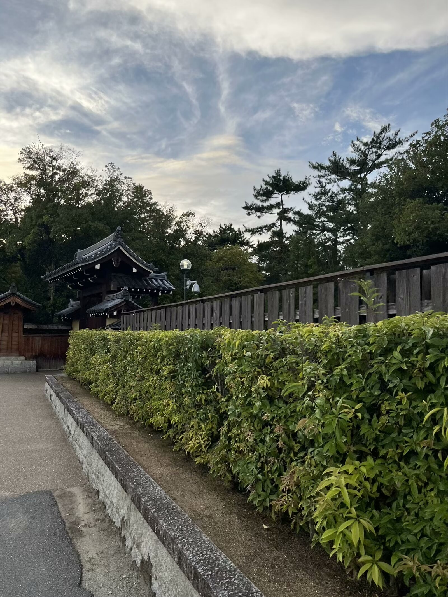
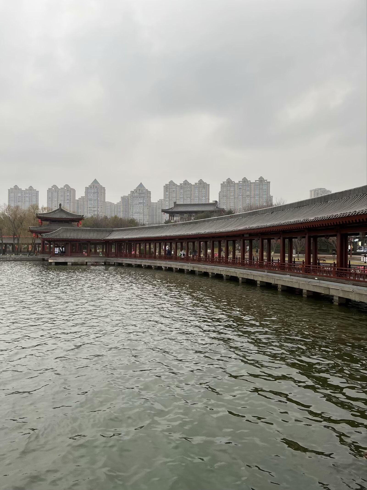
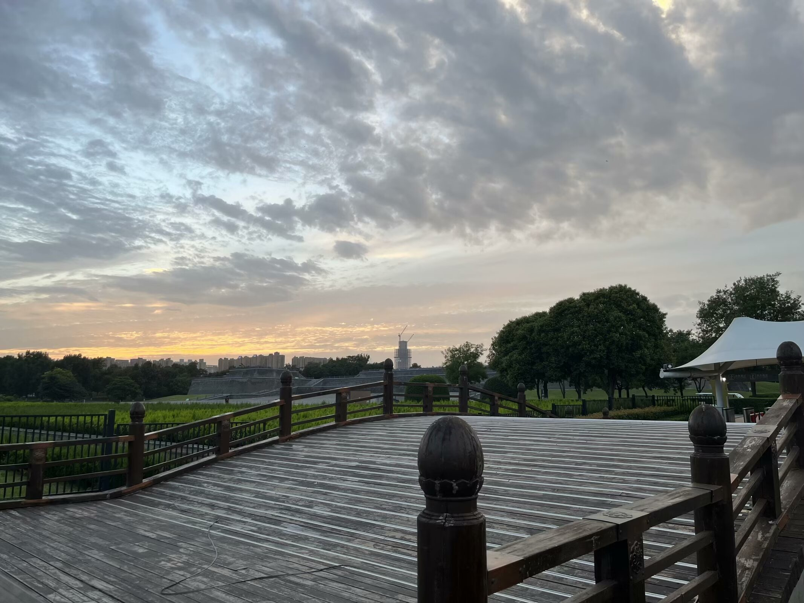
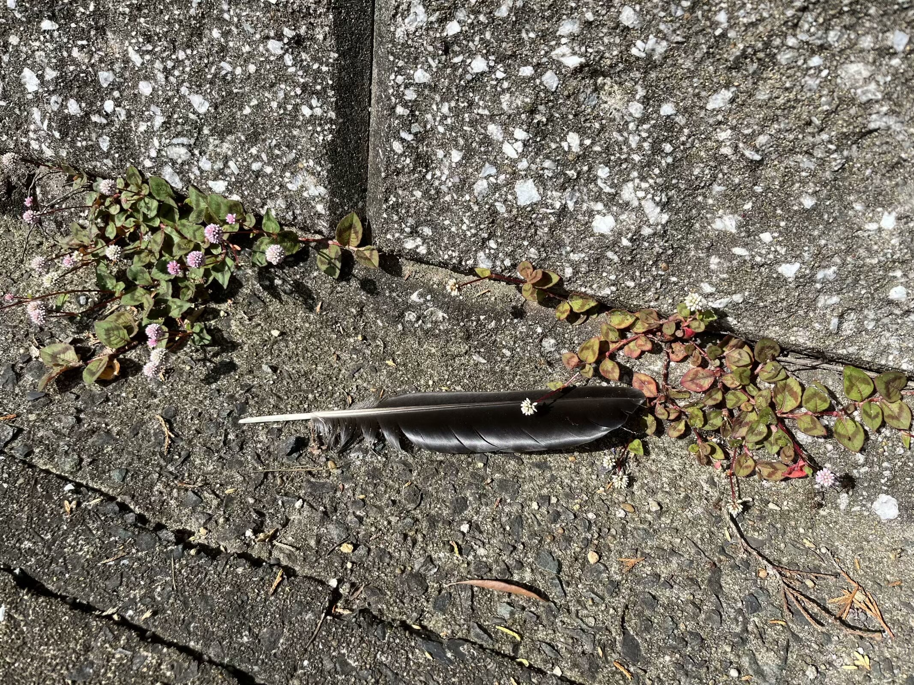
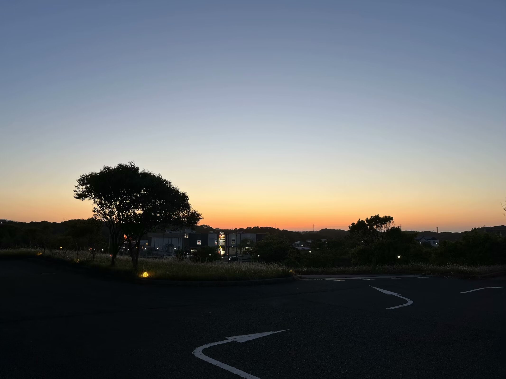
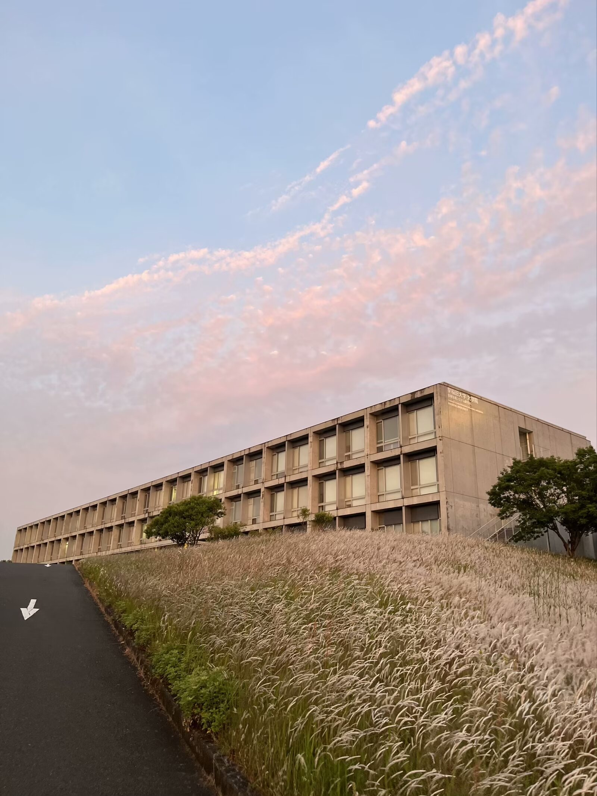
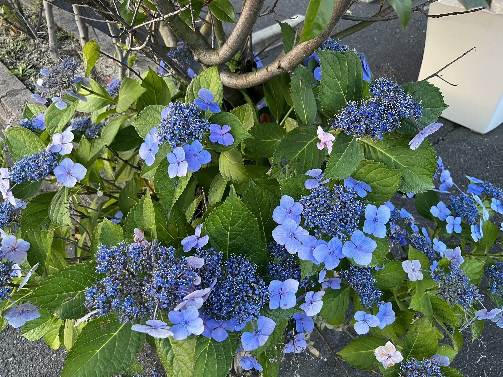

### 无题(花落晚风芳菲尽)
> 2023年11月1日

花落晚风芳菲尽，雨洒晴空滂沱陨。

陌野独归寻过客，高堂嘉宴空知音。

雪葬旧都几人悯，水满新城何处寻。

长空星落悲远道，碧谷月华伤朝菌。

### 无题(花散りて)
> 2023年11月9日

花散りて

星屑如き

渡り鳥

そらの花畑

観る人何方

### 无题(城西粉雪芳菲现)
> 2024年1月26日

城西粉雪芳菲现，剑海空云几度先。

巾幡遥寄关下地，水卷风起门司前。

暗野波回金海路，新阳浪伴神姬途。

桃山远梦清水寺，平安星落满天都。

### 无题(落花长安散尘灵)
> 2024年3月19日

落花长安散尘灵，雾雨浅川入海清。

云卷旧宫凭栏漠，烟绯新城托故情。

暗夜孤灯影落日，明朝风起舞空室。

四野茫茫高歌尽，举目苍苍含得失。

### 无题(春舞千山綠)
> 2024年4月7日

春舞千山綠，花重百家馨。

星隱三川曲，夜濃空月形。

### 无题(月出山华江林静)
> 2024年4月11日

月出山华江林静

星影烁金归梦情

独往深巷风铃慢

忽逢客来侧身轻

四海相望含秋境

空夜苍茫雾微明

今朝行罢八荒路

却看春鸟舞落英

### 无题(霜染秋叶风满泪)
> 2024年4月23日

霜染秋叶风满泪，墨香春蝶抚剑归。

浅梦中州思故土，千山陌旅暖日追。

欲行试问车前路，高低远近几峰回。

今朝别过今朝友，笑看飞雪寒冬梅。

### 无题(七色に)
> 2024年4月26日

七色ににじむは空へ帰る鳥

風吹き香る雨降りけめり

### 无题(微雨忆春景)
> 2024年5月13日

微雨忆春景，淡星望晓明。

前路归无定，晚秋几度晴。

### 无题(夏雨收花霰)
> 2024年5月15日

夏雨收花霰，秋风引画船。

天河横夜雪，瀚海越新年。

### 雨霖铃 暑
> 2024年5月21日

夏虫知秋，风铃声晚，暖梦失途。故里星染初霞，辗转侧，长歌无路。漫取诗书充目，释卷叹良渚。窗棂月，踏碎江波，千载清光犹春驻。

年年瑶台生桂树，玉兔间，广寒恒娥舞。仰问天河沓度，萤火稀，岁又析木。筑紫来游，泛舟浅川珠落华服。怀信遥寄远方客，却无言说处。

### 浣溪沙 六一
> 2024年6月1日

夜泊天衢月出云，风帆一荡梦邀君，落毫星舞墨衣裙。

客宴今州深巷里，笑谈刀笔扫千军。霜华碧海浪纷纭。

### 满江红 星火
> 2024年6月23日

旧岁春光，风正好、木犀芳洁。新友共、泛舟江野，漫波清冽。畅论芳菲生杜若，山花未敢争香蔎。凭栏望、海内引千帆，逢佳节。

秋寒月，冬雪歇。深谷碧，平川折。落红衰沃土，暗繁生灭。航迹何寻孤梦远，六分星影源溪辙。定前路、滔浪越中洋，惜君别。

### 无题(我か裾に)
> 2024年6月26日

我か裾にふりみちてゆく曙は

仄々見ゆるひかけらなめり

### 青梦
> 2024年6月20日

玉树清歌夕日暮，孤城淡影阳关途。

彩霞天落伤旧事，粉雪空卷起新都。

彼岸佳人花开路，长风万里送丹朱。

千载星波归梦远，秋思难渡春桃符。
