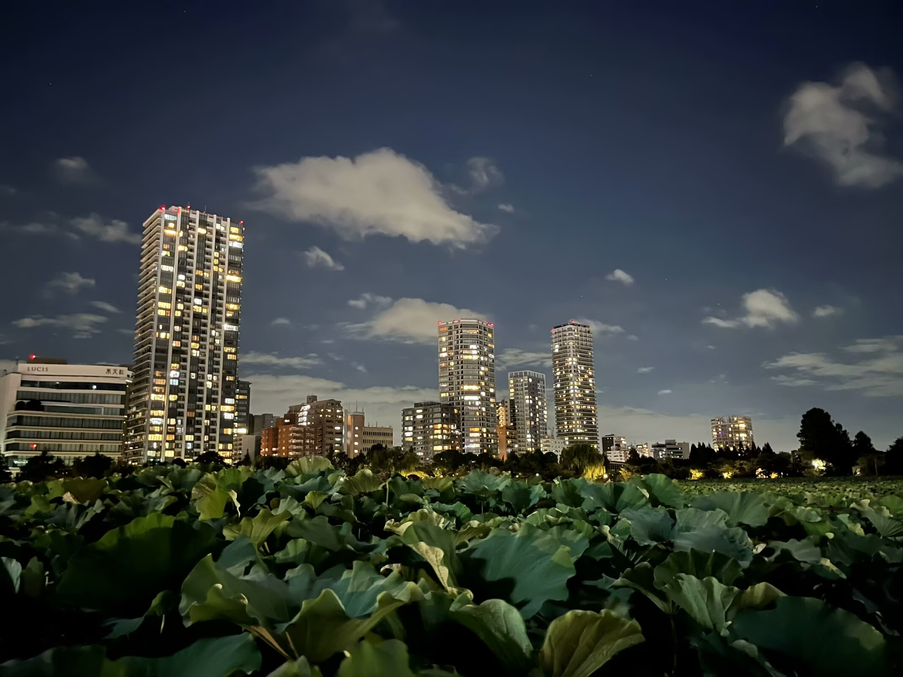
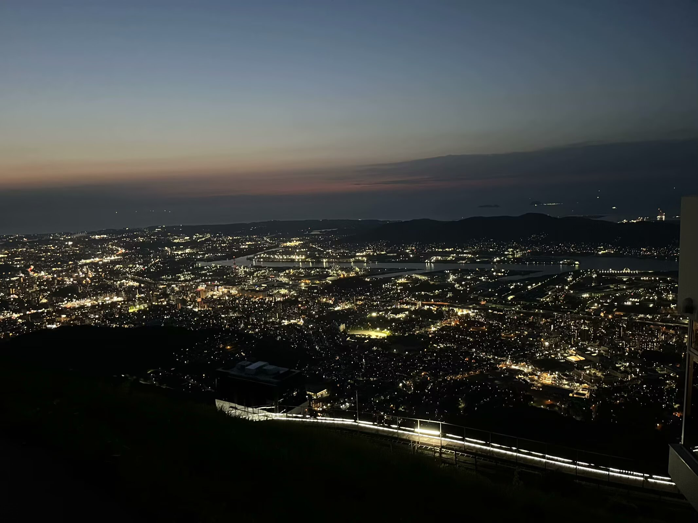

### 无题(花落晚风芳菲尽)
> 2023年11月1日

花落晚风芳菲尽，雨洒晴空滂沱陨。

陌野独归寻过客，高堂嘉宴空知音。

雪葬旧都几人悯，水满新城何处寻。

长空星落悲远道，碧谷月华伤朝菌。

### 无题(花散りて)
> 2023年11月9日

花散りて

星屑如き

渡り鳥

そらの花畑

観る人何方

### 无题(城西粉雪芳菲现)
> 2024年1月26日

城西粉雪芳菲现，剑海空云几度先。

巾幡遥寄关下地，水卷风起门司前。

暗野波回金海路，新阳浪伴神姬途。

桃山远梦清水寺，平安星落满天都。

### 无题(落花长安散尘灵)
> 2024年3月19日

落花长安散尘灵，雾雨浅川入海清。

云卷旧宫凭栏漠，烟绯新城托故情。

暗夜孤灯影落日，明朝风起舞空室。

四野茫茫高歌尽，举目苍苍含得失。

### 无题(春舞千山綠)
> 2024年4月7日

春舞千山綠，花重百家馨。

星隱三川曲，夜濃空月形。

### 无题(月出山华江林静)
> 2024年4月11日

月出山华江林静

星影烁金归梦情

独往深巷风铃慢

忽逢客来侧身轻

四海相望含秋境

空夜苍茫雾微明

今朝行罢八荒路

却看春鸟舞落英

### 无题(霜染秋叶风满泪)
> 2024年4月23日

霜染秋叶风满泪，墨香春蝶抚剑归。

浅梦中州思故土，千山陌旅暖日追。

欲行试问车前路，高低远近几峰回。

今朝别过今朝友，笑看飞雪寒冬梅。

### 无题(七色に)
> 2024年4月26日

七色ににじむは空へ帰る鳥

風吹き香る雨降りけめり

### 无题(微雨忆春景)
> 2024年5月13日

微雨忆春景，淡星望晓明。

前路归无定，晚秋几度晴。

### 无题(夏雨收花霰)
> 2024年5月15日

夏雨收花霰，秋风引画船。

天河横夜雪，瀚海越新年。

### 雨霖铃 暑
> 2024年5月21日

夏虫知秋，风铃声晚，暖梦失途。故里星染初霞，辗转侧，长歌无路。漫取诗书充目，释卷叹良渚。窗棂月，踏碎江波，千载清光犹春驻。

年年瑶台生桂树，玉兔间，广寒恒娥舞。仰问天河沓度，萤火稀，岁又析木。筑紫来游，泛舟浅川珠落华服。怀信遥寄远方客，却无言说处。

### 浣溪沙 六一
> 2024年6月1日

夜泊天衢月出云，风帆一荡梦邀君，落毫星舞墨衣裙。

客宴今州深巷里，笑谈刀笔扫千军。霜华碧海浪纷纭。

### 满江红 星火
> 2024年6月23日

旧岁春光，风正好、木犀芳洁。新友共、泛舟江野，漫波清冽。畅论芳菲生杜若，山花未敢争香蔎。凭栏望、海内引千帆，逢佳节。

秋寒月，冬雪歇。深谷碧，平川折。落红衰沃土，暗繁生灭。航迹何寻孤梦远，六分星影源溪辙。定前路、滔浪越中洋，惜君别。

### 无题(我か裾に)
> 2024年6月26日

我か裾にふりみちてゆく曙は

仄々見ゆるひかけらなめり

### 青梦
> 2024年6月20日

玉树清歌夕日暮，孤城淡影阳关途。

彩霞天落伤旧事，粉雪空卷起新都。

彼岸佳人花开路，长风万里送丹朱。

千载星波归梦远，秋思难渡春桃符。

### 水调歌头 江夜
> 2024年7月22日

短桥清波重，虹彩散深空。夏蝉声急，风舞童戏过江东。春水应知往事，入伏更堪秋别，岁纪燕双鸿。鬓丝抚人面，物是故情浓。

徘徊处，露台上，叶荷中。月圆星暗，万户灯火映天红。料在小园幽径，携手轻回浅夜，暖梦伴蒿丛。细雨惊初寐，书卷印身同。

### 忆江南 秋梦
> 2024年8月4日

星暗夜，风雪灞桥天。

古道长亭希晓月，新秋流火润丰眠。

晴梦故城边。

### 赠无端雨
> 2024年8月21日

塞外风萧瑟

云低鸟音失

盛夏君逢处

春秋影落日

### 秋木箧
> 2024年9月9日

夜落花色雨意稠，风满旧居又中秋。

浅川遥注三番地，暖叶遍荫八重洲。

命定苍天难易就，劫波散尽怎堪忧。

今昔行路少息处，凭图再计明朝流。

### 秋分夜
> 2024年9月22日

秋风落雾星华重，细雨惊雷月露浓。

纸漫空言八荒路，毫挥妙论四海松。

长平芳草春日影，街亭远山马牛行。

罢看东市新磨镜，归出朔关旧梦轻。

### 秋景
> 2024年10月14日

密林扶风长，微雨浸瓦凉。

小峰回径处，金桂暖秋香。

朝霞千里路，夕日百家孤。

夜月星云淡，江洋岛陆殊。

### 早
> 2024年11月17日

星落秋风动

鸟栖暖日中

小城朝芷雾

江北漫蒿丛

柳舒人不在

波回浪复来

故城石阶上

曲径生幽苔

### 点绛唇 星旅
> 2025年1月17日

旧室新风，冬阳乍暖红山阔。有明浪沫，沙冷波回裾褐。

彼岸星繁，中昼孤行客。珠罗碧，影光遥隔。春满青芽烟陌。

### 无题(雲焚火)
> 2025年4月7日

雲焚火　響野照す　夕風に

高原ぞ見ゆ　清波巻

### 浪淘沙令 初夏
> 2025年5月16日

风乱九州灵，日隐烟青。花残香雨落天星。长梦红尘孤碧影，天道清泠。

何夜伴流萤！故友曾经，霜寒书剑舞中庭。独在天涯听海色，礁岸幽溟。

### 虞美人 夏风
> 2025年7月21日

夏风清月花雨落，小梦惊雷薄。初春山色淡星眠，何夜关中桑梓故灵前。

秋凉几度身堪住，客适天涯路。独行三顾若无言，相伴芳菲冬柳泪沾痕。

