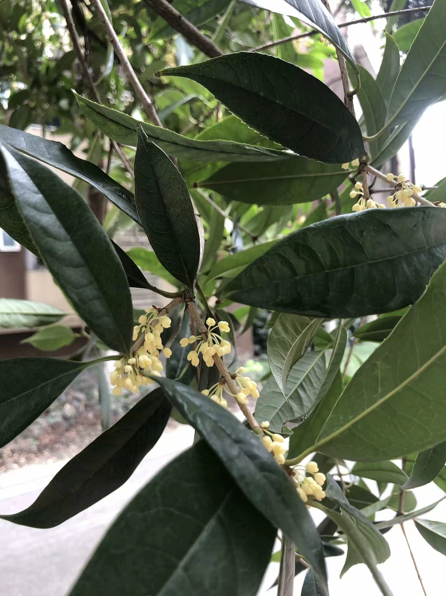
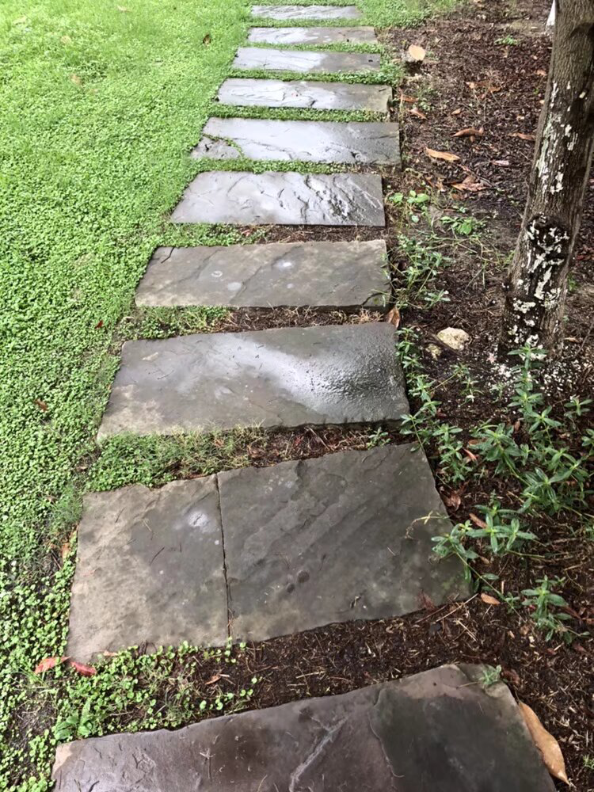
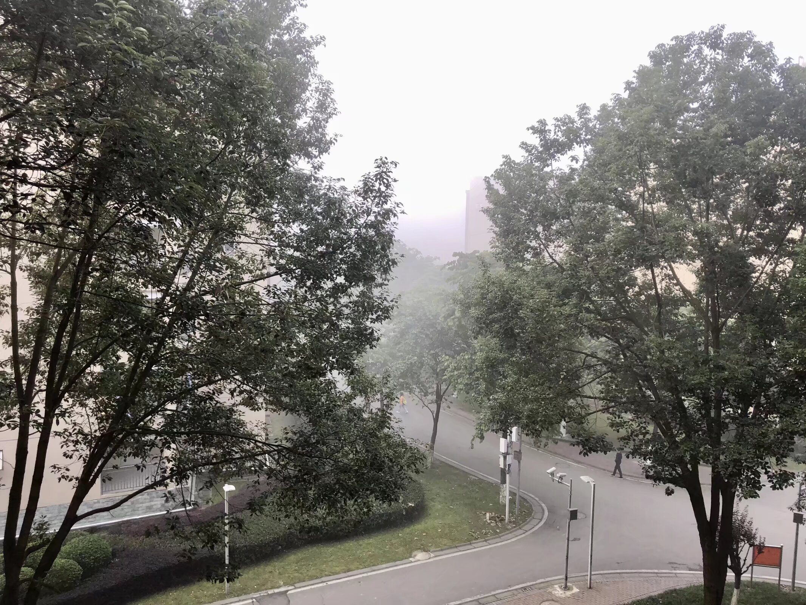
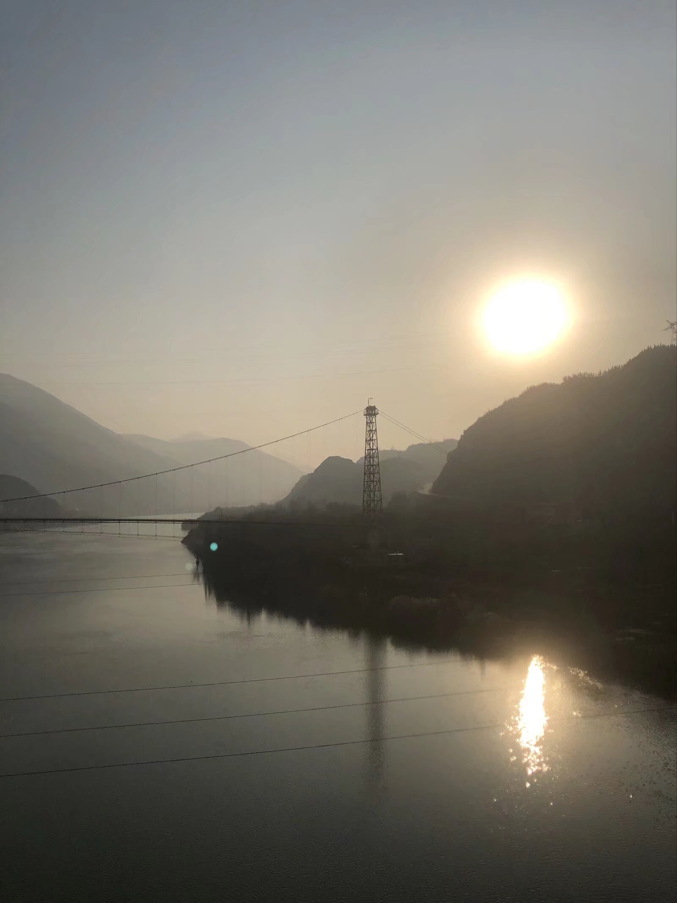
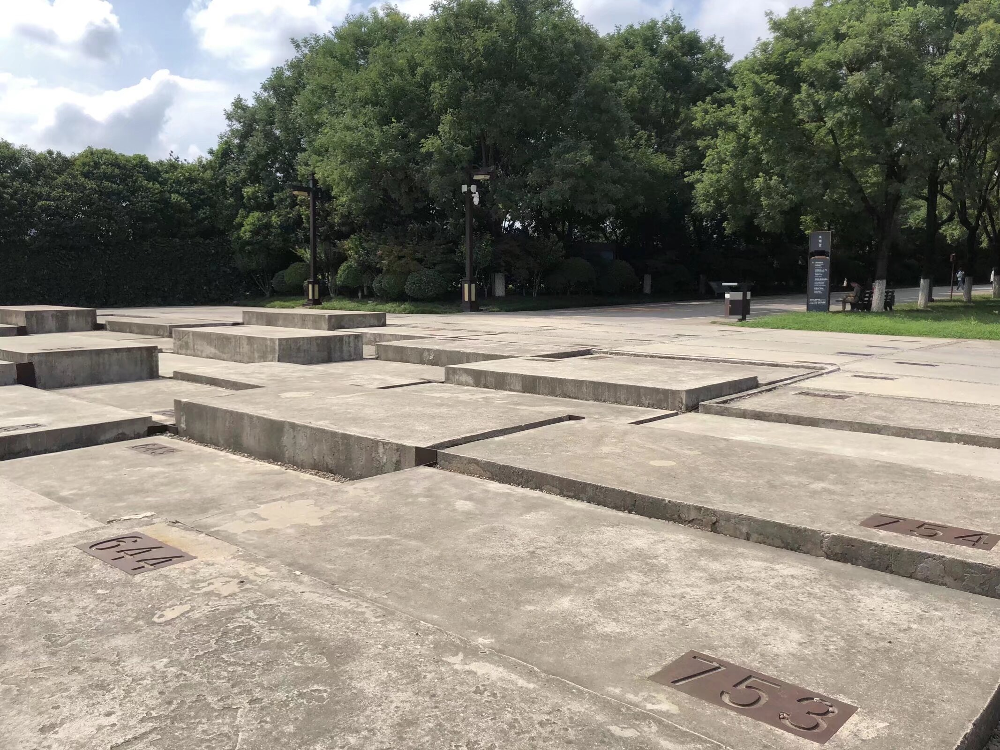
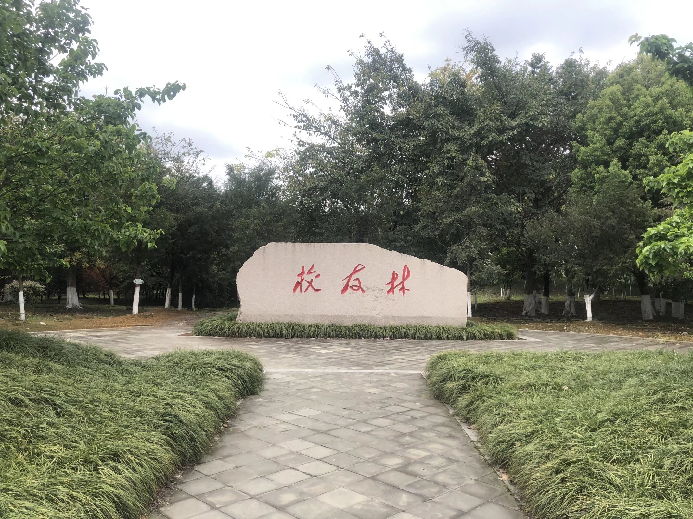
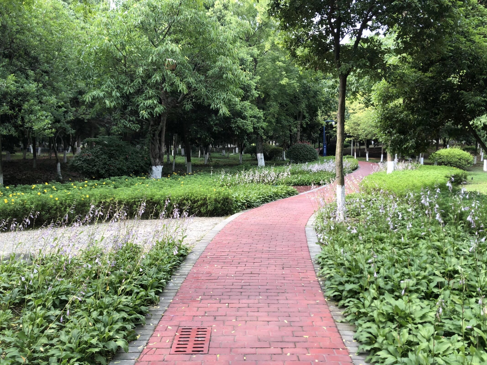
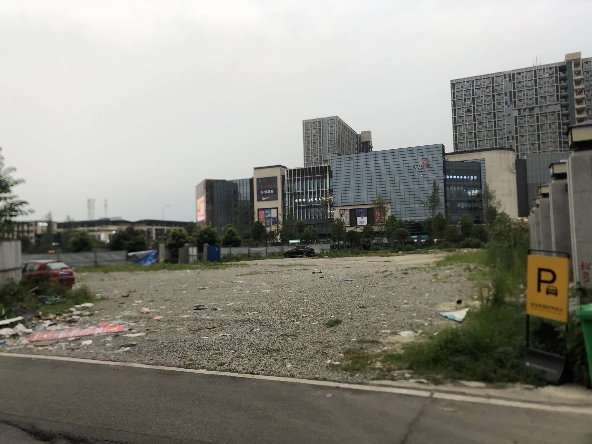
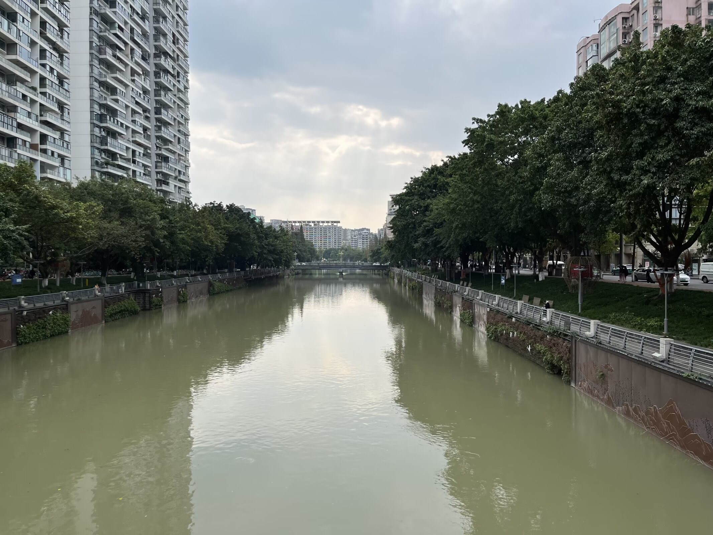
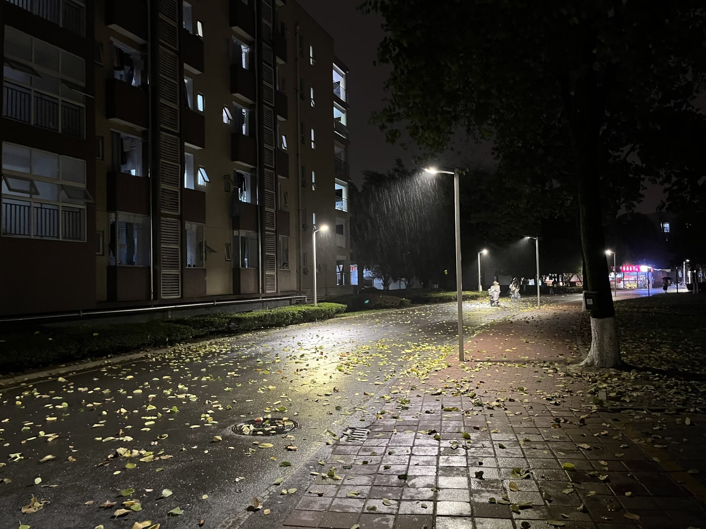

### 无题(金木犀)
> 2019年9月7日

金木犀

薫り遠くへ

届きつつ

花は咲かねど

匂ひ飛びけり

### 秋夜の寒さを感じて詠める
> 2019年9月19日

水の影

見ゆる星屑

雲流れ

並木道より

雫垂りつつ

### 无题(霧重し)
> 2019年11月21日

霧重し

寒さを感じて

布団に入り

### 无题(野旷风低处)
> 2019年11月26日

野旷风低处，江凌芳草枯。

漫花桑梓陌，飞雪锦官涂。

### 夜半思
> 2020年1月23日

长风万里送春尽，古道千年归客临。

辗转声声马蹄落，踌躇阵阵窗下津。

角声悲壮连秋月，星河动摇孤影缺。

平野星垂飞塞北，大江月涌断玉珏。

玉门西望路漫漫，阳关三别泪蹒跚。

长烟落日孤城闭，雪风时雨沧海端。

### 无题(春草生まれり)
> 2020年3月24日

春草生まれり

長風吹きつつ

大空広がり

世の中千代ゟ

徒然あらむや

人々世に生き

数多事を見

未来知らじ

時流れり

夢ゟいつか

覚めるるも

幸ならむや

### 枫
> 2020年5月4日

清水浓云吹墨雪

平薇淡草散青山

漫风低树摇春尽

瀚海孤帆彻夜还

### 无题(初夏の息吹を感じ)
> 2020年7月7日

初夏の息吹を感じ、青い青い空を見上げる

前年の物事を思い出し、まるで夢に在る景色

時間は人を待たず、未来は何時も朧

千早振り、豊作を祈る　稲荷みこ

創り出した　儀式感

人間のみ味う　神聖

風が吹き　全てを融かす

### Fruchin Song
> 2020年11月15日

夜明风浸月，星凛雪濯天。

凌波梦归远，策马飞旧年。

### 刻
> 2021年1月15日

碧树红枫荆棘暮，香草苦菊松柏孤。

九天万里长风在，五洋千载微波浮。

### 雫
> 2021年4月29日

夏色飘渺天无际

月影徘徊夜未明

古今一梦归天地

星河斗转又曾经

### 无题(朝霧に)
> 2021年6月18日

朝霧に方舟飛ばゆ日が昇り星空博く静かに祝う

### 无题(风落晴空花开月)
> 2021年7月23日

风落晴空花开月，雨漫星河雪满天。

桑梓婆娑沧海笑，古卷斑驳孤影眠。

### 花园
> 2021年8月15日

我走在冬天的夜晚

踏着积满灰雪的小径

走过默默伫立的假山

来到在夜色中沉睡的花园

花草无言，北风吟唱着夜的挽歌

 

我站在高楼的阶梯间

夕日如火，将白墙烧成粉色

就好像在初春的公园

桃花遍野，笑靥踏歌飞向远方的蓝天

 

夕阳西下，在暗金色的天空中

大片的雪花飘落

我拾级而下，推开门，走向慢慢沉寂的夜色

穿过青白色的街灯

穿过空无一人的斑马线

穿过无声的夜

来到终末的花园

 

轻轻推开茅屋的门

他们似乎还没有回来

屋内一片静谧

等待着新一天的到来

 

新的一天终会到来

冬天也终将结束

但是在和煦的春风下

永远的长夜也在安眠

### 无题(時流れ)
> 2021年9月7日

時流れ

古き名傳へ

夜長し

昔光れど

今何処にて

### 无题(とりで見ゆ)
> 2021年9月9日

とりで見ゆ

築きぬる物

冷ややかな

川に船なき

星青かめり

### 无题(古の)
> 2021年9月10日

古の

物な也けり

爽やかな

風飛び立ちぬ

空に雲無し

### 无题(あめ上がり)
> 2021年9月16日

あめ上がり

新たなる空

ゆめさめて

鳥なき枝に

歌渡るなり

### 无题(朝期虹野)
> 2021年11月17日

朝期虹野　懸歌流空平　向紀悠希

緋綺雲似　遊微亭津津　多香奈詩

### 无题(春愁)
> 2022年4月17日

春愁　鳥なきながら　走りつつ

林に座り　人こそ見えれ

### 无题(夜登り)
> 2022年5月26日

夜登り　人なき雨に　身を隠し

橋かかりねば　出会はゆるなり

### 无题(悲しみの)
> 2022年5月31日

悲しみの　彼方へ歩き　暁に

夢とて何処　今更も見じ

### 无题(奏鳴き)
> 2022年6月2日

奏鳴き　蛍の光　月の文

水無月に入り　夜の灯火

### 无题(古の)
> 2022年6月16日

古の　風吹き渡り　夏至

別れ常事　笑へ旅立たむ

### 落
> 2022年7月14日

青空云淡漠

旷野鸟长歌

日薄风起地

花重星落河

九天别沧海

八荒行樵柯

百川通昼夜

千舟竞风荷

古道归故土

方碑伴梦戈

魂游冲碧落

泪洒葬江河

月明星低唱

树稀鹊高飞

日月隐萧水

星汉耀青波

### 无题(錦江を)
> 2022年11月1日

錦江を越えて進みて渡り鳥

何処へ行かむ彷徨ふ者よ

### 无题(冬のはな)
> 2022年12月2日

冬のはな　さむやあかつき　年の市

暗闇にこそ　星の輝け

### 无题(旅立てり)
> 2022年12月6日

旅立てり　窓外のゆき　海越えて

鳥は何方へ　枝に棲むべし

### 无题(春風は)
> 2023年3月13日

春風は　ひま囁きて　雨なれば

こぞゆるふる葉　みなとしにけり

