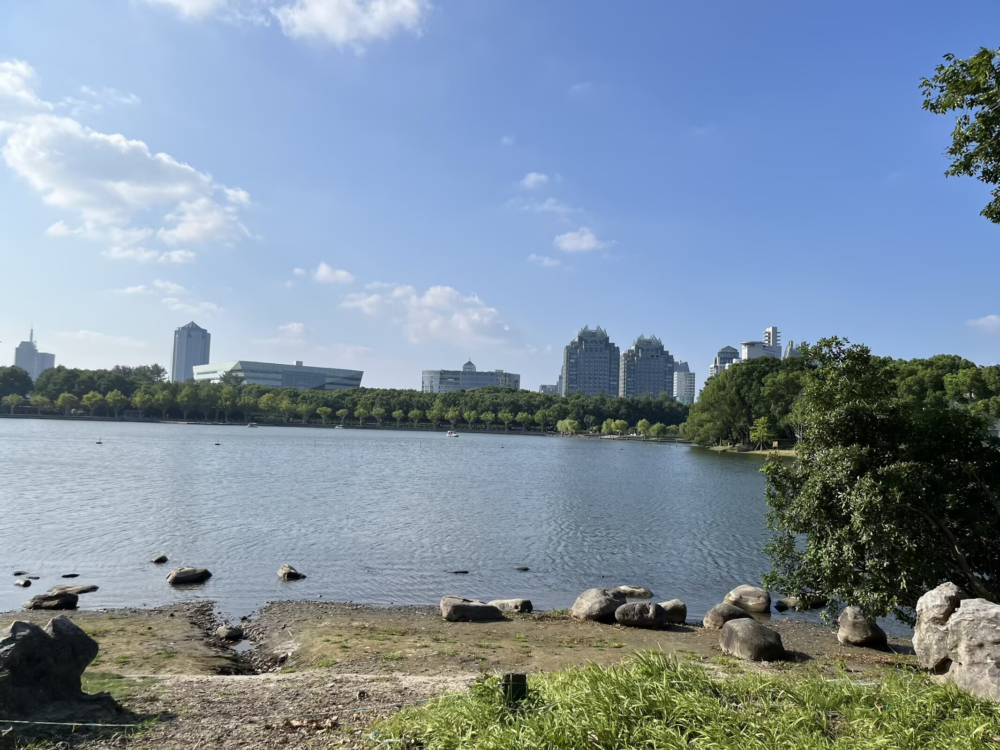
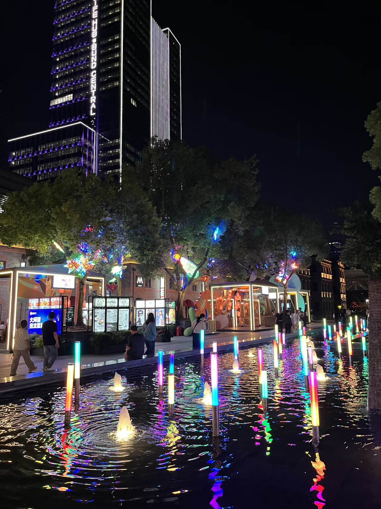
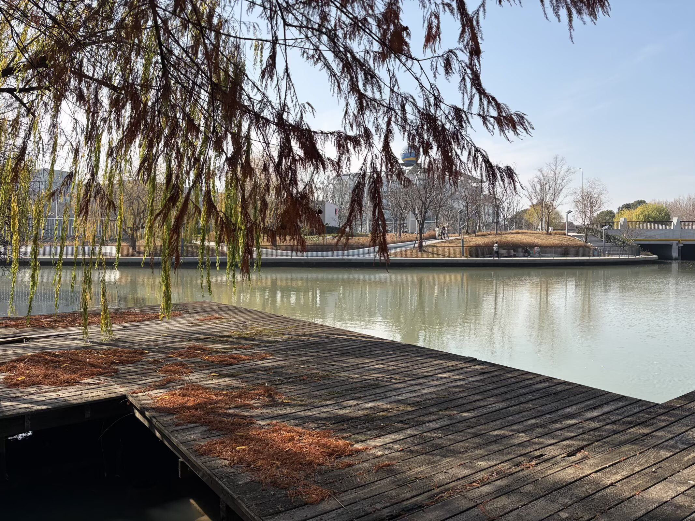
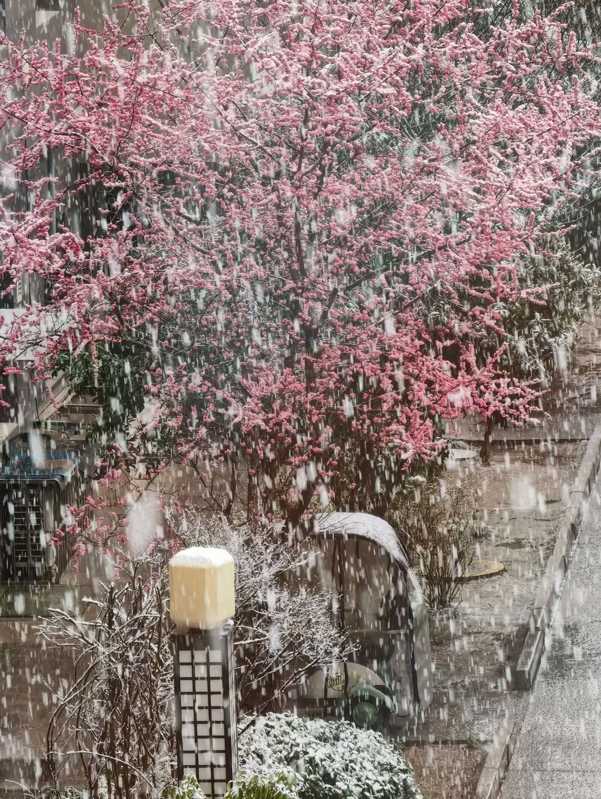
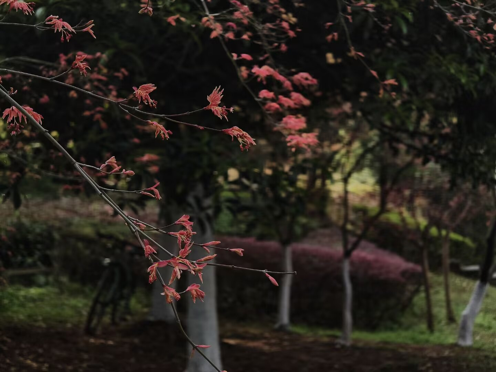
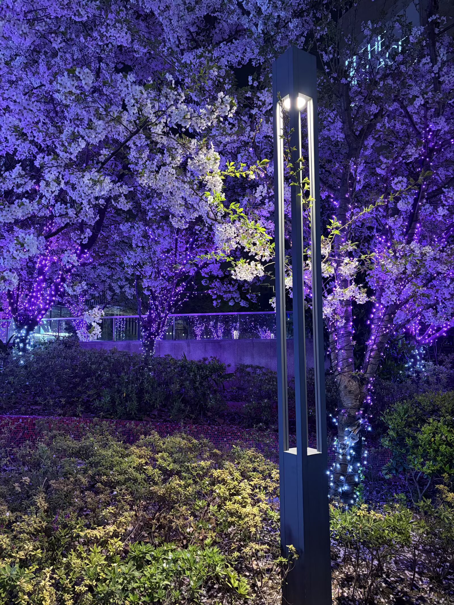

### 湘月 迎春
> 2025年8月17日

梦梅冷瑟，点清烟重墨，芳草何若？小阁西闱，细雨陌，晚夏蝉鸣声薄。暖夜香回，孤舟摇曳，水染芙蓉萼。春申江畔，碧波浪卷轻泊。

牛女共聚星河，秋凉渐起，锦城同相约。故友新交，笑语处、风急何妨堪乐。斗转星移，人非物是，泪染桑田寞。残阳浓影，独行看尽花落。

### 满江红 冬夜
> 2025年12月25日

雨夜西州，霜寒处、涛声梦蝶。三日月、星粼雾重，岁恒天接。万户灯华伤白昼，且将笑语迎新帖。看朱门、饮宴越明年，觥筹烨。

无边叹，秋落叶。人故事，何堪叠。今宵醉冬雪，独怀书箧。睡眼蒙眬观世界，恨伐娑阵阵风云涉。瀚海行、何处我身栖，空枝折。

### 江城子 芙蓉秋深木影凝
> 2026年1月18日
 
芙蓉秋深木影凝，对罗绫，点玉冰。紫竹春兰，冬柳别新征。故国丘墟浮满月，山河静，夜明澄。

### 蝶恋花 春雪
> 2026年2月23日

骤雪长安春雨后。寂寂寒窗，三顾冬时久。行罢江南风乱柳，关山远隔天涯友。

何夜烟波灯共酒。岁岁新声，鸟雀齐天寿。望月半缺观北斗，参商难觅辰星朽。

### 无题(梢棲む)
> 2026年3月9日

梢棲む朱雀の羽根に春萌ゆる我がみに覚ゆこぞ降る雪を

### 鹧鸪天 小夜清沙淡水河
> 2026年4月11日

小夜清沙淡水河，月摇风树影婆娑。春申一梦冬烟去，行遍江堤吟岁歌。

落樱下，舞绫罗，花繁花谢几般多。目极千里芳菲客，长水无言湛湛波。

### 黄金缕 山隐西湖烟雨路
> 2026年6月14日

山隐西湖烟雨路。翠柳清波，半夏风少住。一去江陵千里渡，又逢新卒集新赋。

可叹诗生无定数。秉烛勾回，觞引希三顾。漫棹武陵舟不溯，夜阑归楫惊朝露。

