### 湘月 迎春
> 2025年8月17日

梦梅冷瑟，点清烟重墨，芳草何若？小阁西闱，细雨陌，晚夏蝉鸣声薄。暖夜香回，孤舟摇曳，水染芙蓉萼。春申江畔，碧波浪卷轻泊。

牛女共聚星河，秋凉渐起，锦城同相约。故友新交，笑语处、风急何妨堪乐。斗转星移，人非物是，泪染桑田寞。残阳浓影，独行看尽花落。

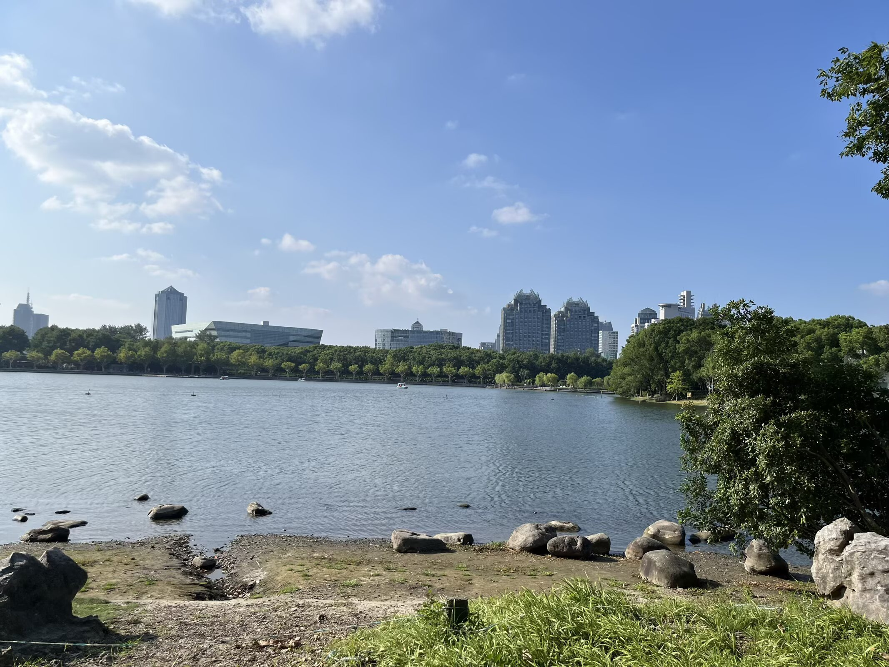

### 满江红 冬夜
> 2025年12月25日

雨夜西州，霜寒处、涛声梦蝶。三日月、星粼雾重，岁恒天接。万户灯华伤白昼，且将笑语迎新帖。看朱门、饮宴越明年，觥筹烨。

无边叹，秋落叶。人故事，何堪叠。今宵醉冬雪，独怀书箧。睡眼蒙眬观世界，恨伐娑阵阵风云涉。瀚海行、何处我身栖，空枝折。

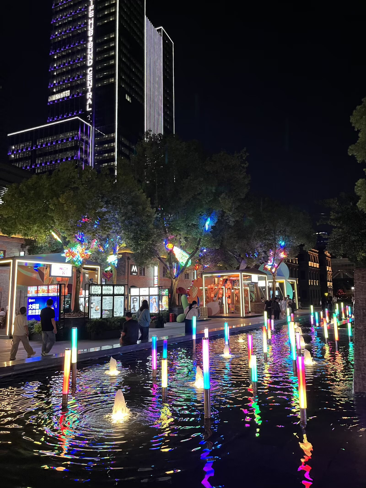

### 江城子 芙蓉秋深木影凝
> 2026年1月18日
 
芙蓉秋深木影凝，对罗绫，点玉冰。紫竹春兰，冬柳别新征。故国丘墟浮满月，山河静，夜明澄。

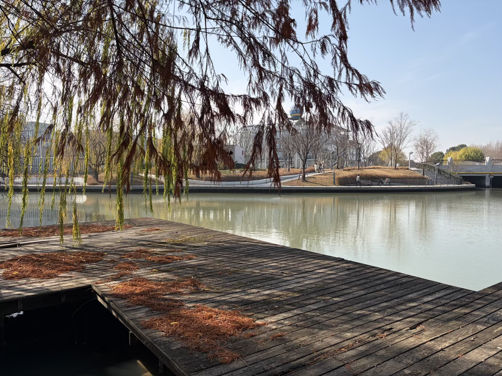

### 蝶恋花 春雪
> 2026年2月23日

骤雪长安春雨后。寂寂寒窗，三顾冬时久。行罢江南风乱柳，关山远隔天涯友。

何夜烟波灯共酒。岁岁新声，鸟雀齐天寿。望月半缺观北斗，参商难觅辰星朽。

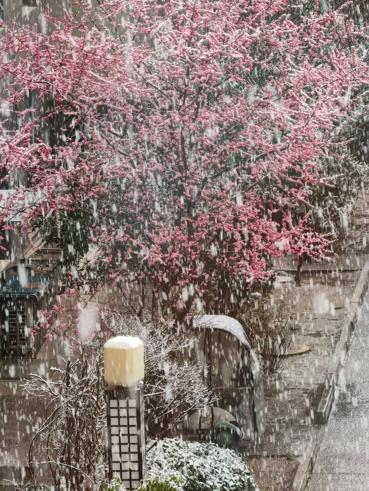

### 无题(梢棲む)
> 2026年3月9日

梢棲む朱雀の羽根に春萌ゆる我がみに覚ゆこぞ降る雪を

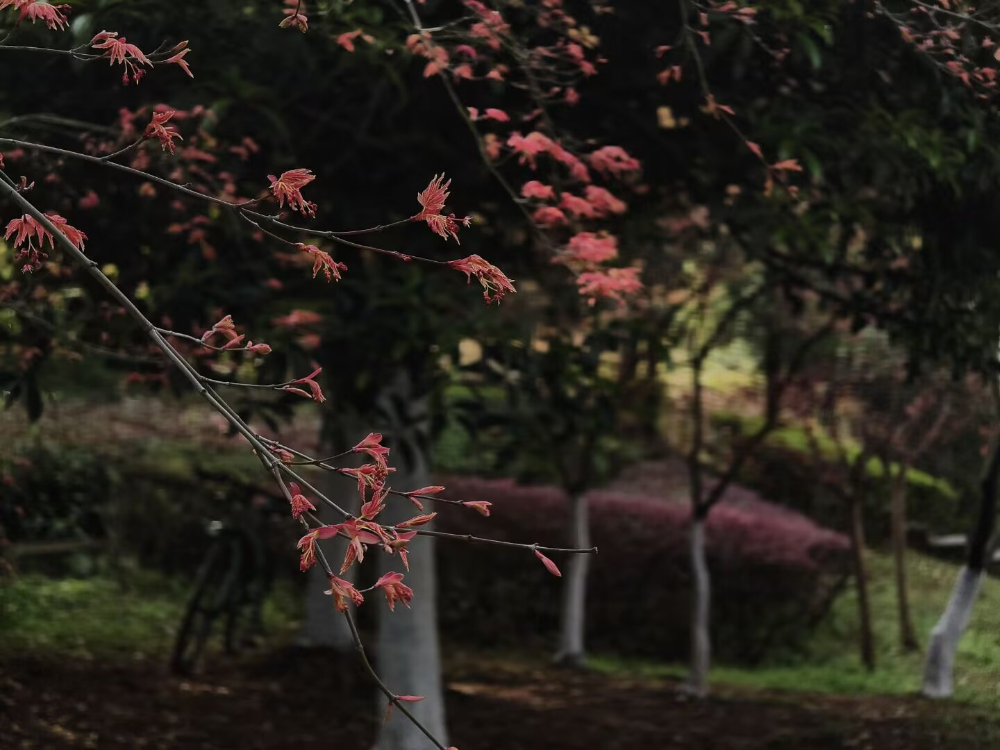

### 鹧鸪天 小夜清沙淡水河
> 2026年4月11日

小夜清沙淡水河，月摇风树影婆娑。春申一梦冬烟去，行遍江堤吟岁歌。

落樱下，舞绫罗，花繁花谢几般多。目极千里芳菲客，长水无言湛湛波。

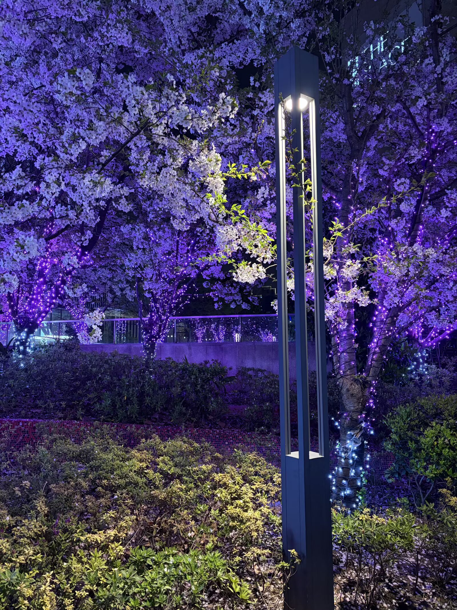

### 黄金缕 山隐西湖烟雨路
> 2026年6月14日

山隐西湖烟雨路。翠柳清波，半夏风少住。一去江陵千里渡，又逢新卒集新赋。

可叹诗生无定数。秉烛勾回，觞引希三顾。漫棹武陵舟不溯，夜阑归楫惊朝露。

### 雨霖铃 初晴夏雨
> 2026年6月16日

初晴夏雨，落英纷乱，夜月如聚。山云相隐无迹，回首处，波澜千古。瀚海天涯难觅，一抔黄金土。晓梦觉、风暖裾寒，独下亭台荡歌舞。

花团漫洒清光缕。对佳音、竟把春江谱！此生可堪几度？烟火静、磬钟和煦。极目天南，星翳枝希，且浮轻羽。更不霁、一别新竹，便入邻家户。

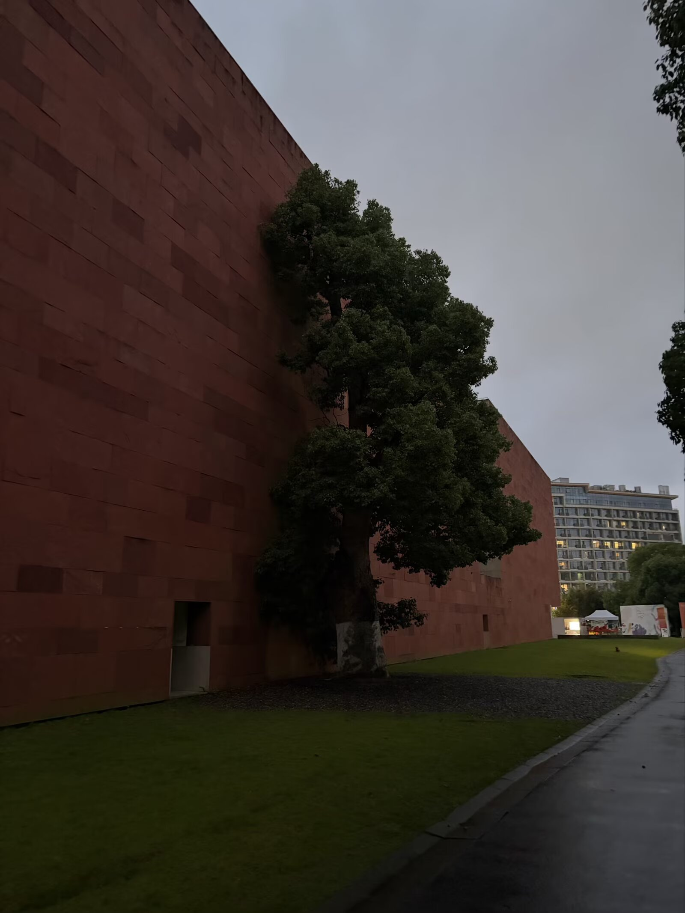

### 相见欢 端阳行客洲头
> 2026年6月21日

端阳行客洲头，雨新休。浪里波回水卷、戏鱼游。

芳菲尽，江流去，故人愁。独对孤城暗夜、月清幽。

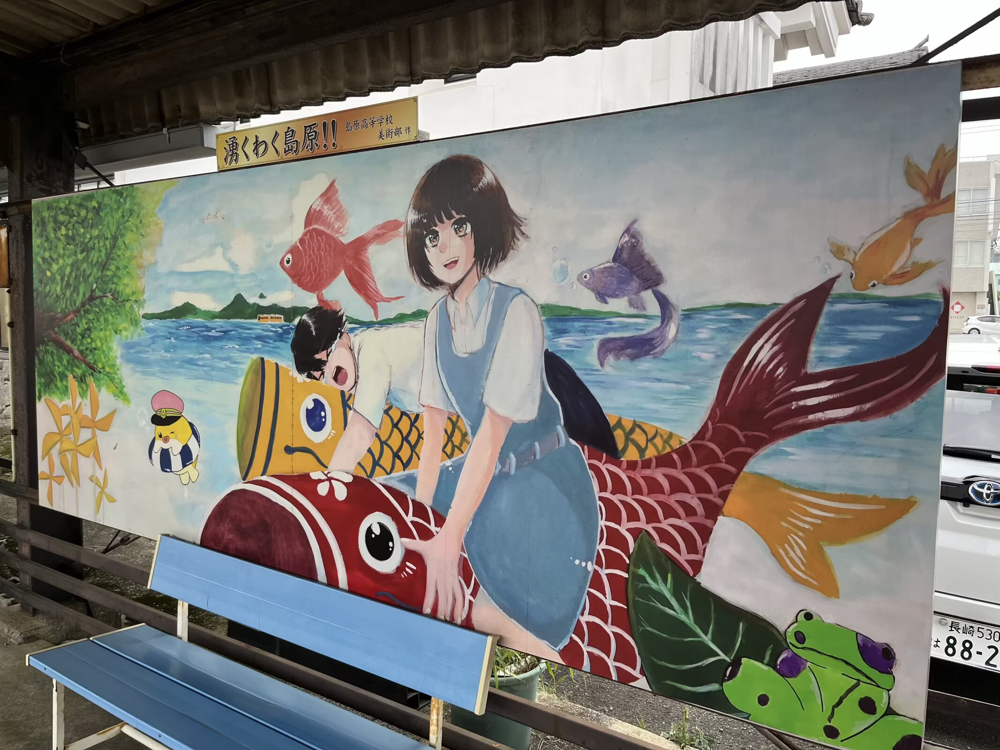

### 吴泾
> 2026年7月8日

金霞碧水暖风来，浪拨层云晚夜开。

我梦因空当落月，遥星遍照石间苔。

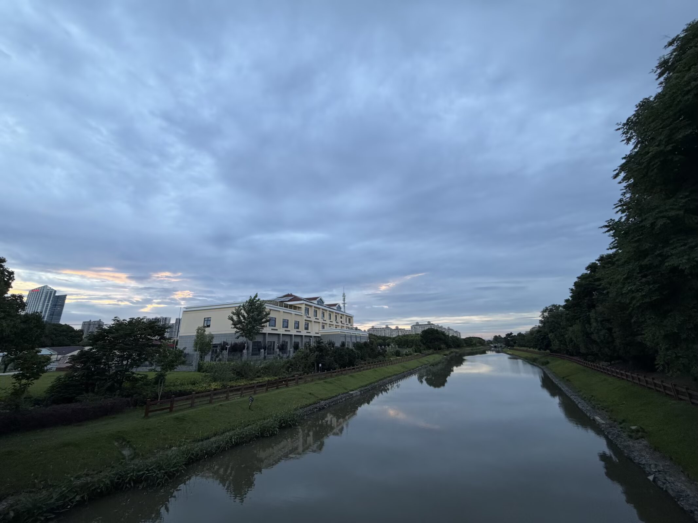

### 桂枝香 江南曾渡
> 2026年7月28日

江南曾渡。夏残困金陵，暑蒸云聚。雪国难当暖日，且斟霜露。荷园佳夜秦淮客，叹无情、乱吟歌赋。落霞浮梦，碧空沉墨，灯明天暮。

又鸡鸣、南朝瑞树。旧城望临安，峰烟清素。骤雨钟山，孤径叶摇轻步。宫闱千里飞扬处，独余芳草今如故。人来物去，春生秋逝，赤楼青墓。

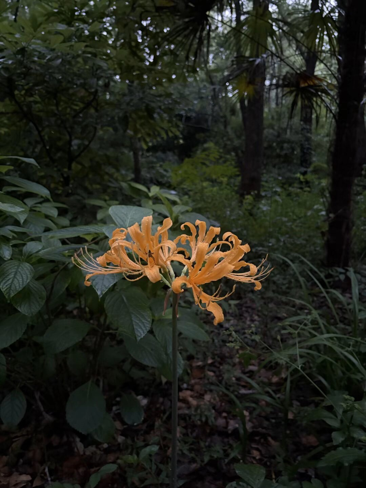

### 醉花阴 夏蝉声乱风声切
> 2026年8月6日

夏蝉声乱风声切，柳岸惜君别。云聚又当年，新卒欢迎，笑把人间说。

欲穷碧落天飞雪，好梦留圆缺。草木翠江阴，星夜微明，暮影沉沙澈。

### 雨霖铃 残阳午后
> 2026年8月21日

残阳午后。墨香浓淡，笔振蛇走。耕回小陌深路，青尾涩，新秋荷柳。日暖重云金翳，只堪几分有。碧落低、银幕苍霞，点点灯花染天亩。

何当共饮清江酒。叹书琴、怎得生不朽！钟期只今安在？佳话里、对千年友。一叶扁舟，轻曳微波，夜泊牛斗。梦觉处、风暗星凉，晓月莹窗牖。

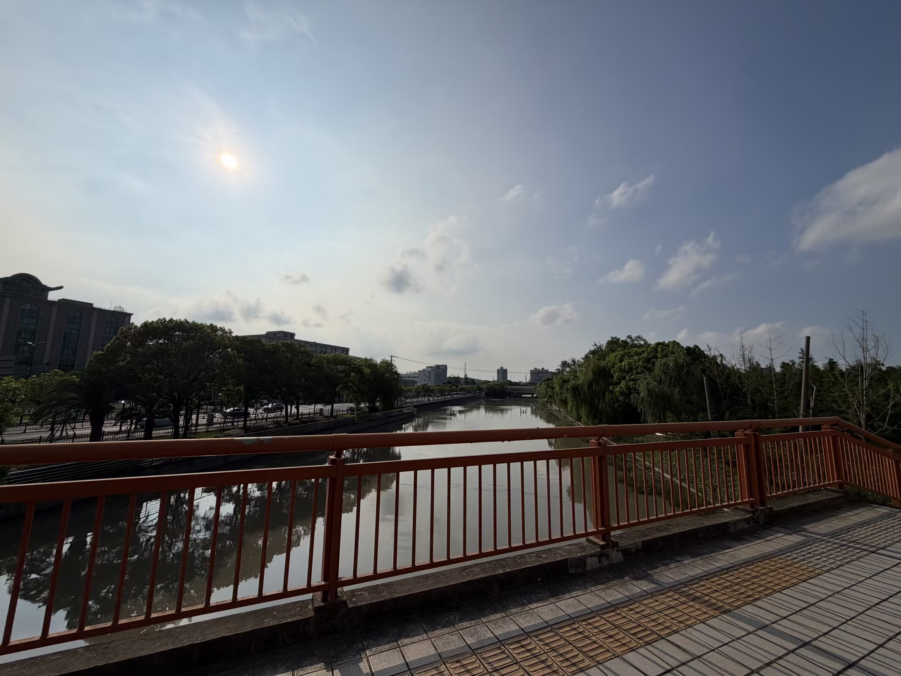

### 赠舟
> 2026年9月7日

碧叶青瓜坠，繁枝白露香。
秋风吹暑尽，独漏好天光。

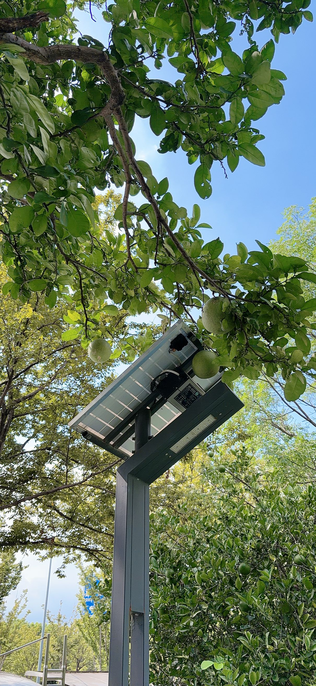
