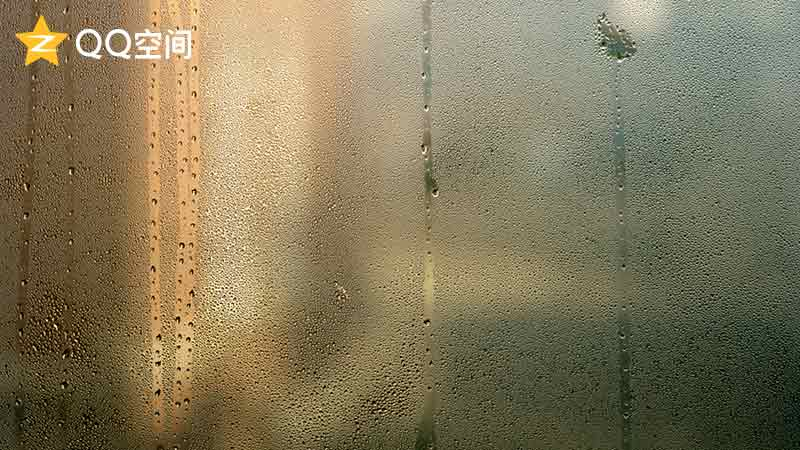

### 无题
> 2015年6月13日

红楼梦呓五色镜，西游记载四高僧。

三国诸葛草船箭，水浒星宿终归一。

### 签名
> 2016年7月21日

潼关一别悠悠日，玉城三顾旦旦秋。

### 无题
> 2015年7月22日

云来天衢，雨洒阡陌。

虹悬青天，骄阳似火。

西阁羽飘，东山尘落。

雪舞三界，梅香九州。

天涯相与今夕同。

### 渔家傲
> 2015年8月4日

日轮西颓吞山巅，月影东升吐水练。

凭栏欲望天际边。

阡陌骈，万户星光碧汉连。

千里悠波映青天，百丈深谷绿林现。

登高远眺车马喧。

浓荫里，倚树稍憩飘细雨。

### 临江仙 古
> 2015年8月19日

滚滚天河飘垂尽，烁烁惊雷斩涛。

千古长生荒英豪。

润物滋天地，混沌伐神刀。

云月芬芳香次第，雨光沁洒丝绦。

天地难通战法道。

纵罔良辰逝，始耐繁星茂。

### 沁园春 桥
> 2015年9月6日

一纸芬芳

银钩铁画

月夜梦长

怀佳人含香

书声朗朗

隔空相望

竹笛悠扬

霞染碧空

夜缀天穹

星星点点耀清芒

天河落

看牛郎织女

鹊桥何方

汩汩溪流轻淌

所谓伊人在水一方

惜前路已断

芳草萧疏

沥沥秋雨

伞倚道旁

四野寒霜

九天凄凉

北斗七星春秋唱

桥尽头

有漫漫星空

巨门摇光

### 方
> 2016年1月7日

山雨欲来风满楼，

寒窗千里惹悲秋。

林雨霏霏莺啼啭，

枫叶飒飒映山红。

锦屏遥寄桑梓意，

游子当歌代母吟。

巡雁北来未天明，

域外峰岭只芜菁。

### 梅
> 2016年3月2日

凭意惹风波微漾

信手拈梅雪自来

上下一白天何在？

四海咸集争英才

几度回眸千里雪

悄悄翘首枯荣败

如今方悔冬年叹

笑颜因风何苦开？

### 无题
> 2016年6月2日

洗尘烟净蝉倦鸣

青叶葱葱旬翁欣

一纸书来千里鹤

期年求索睢园行

纸伞和风微微雨

四野茫茫天地阴

天高地迥有尽日

梓泽丘墟怀古今

### 无题
> 2016年6月14日

子夜天河清

开元北斗明

旧时天有意

故里水留心

### 风
> 2016年8月6日

犹忆当年

阳光缤纷洒满午间

低头沉思

光影悠悠凭风逝

回眸千年

兰亭依旧翼轸成篇

今我来思

霏霏雨雪因风至

轻掩薄窗

月光织就竹笛悠扬

滚滚天河

飘垂而去任狂歌

开元昨夜

长空星辰尤耀九天

北斗遥寄

万户灯火碧汉连

犹忆当年

芳草萧疏秋雨连绵

低头沉思

何为天地落人间

回眸千年

牛郎织女鹊桥昔见

今我来思

三生梦醒林荫前
