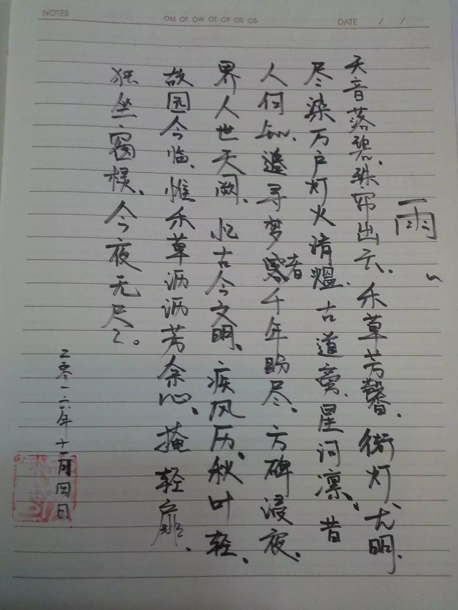
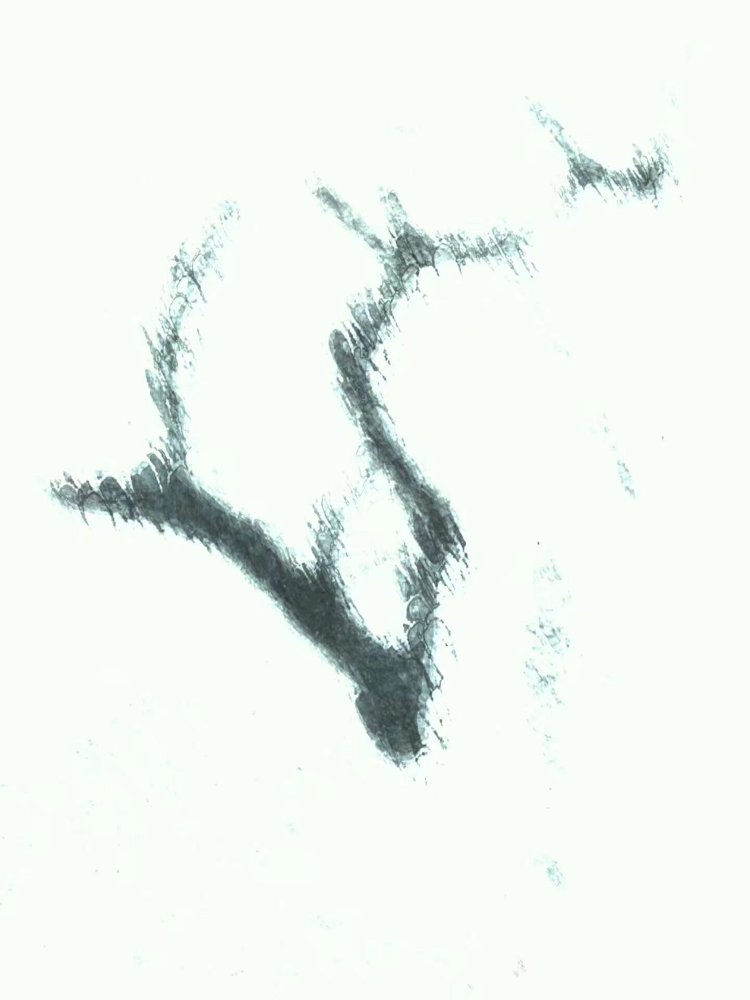
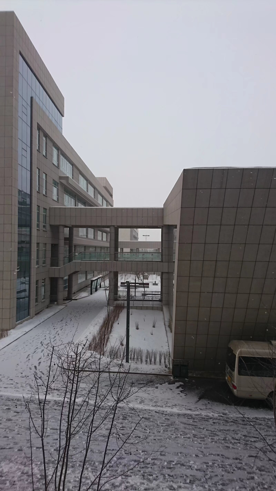

### 雨
> 2016年11月4日

天音落碧，珠帘出云。
禾草芳馨，街灯尤明，尽染万户灯火清熅。
古道旁，星河凛。昔人何知，寻梦者千年盼尽。
方碑浸夜，界人世天阙，忆古今文明。

疾风历，秋叶轻。故园今临，惟禾草沥沥芳余心。
掩轻扉，独坐窗棂，今夜无尽。

### 木雪
> 2017年2月2日
 
腊雪无痕
把节日鲜黄的光影，
绘于壁上吧。
起风了，栏杆上
依稀的暗红旌旗
会扬向何方？
五彩缤纷
四处飞溅的旧年烟火，
薪中胭红的童年时光，
黄绿色的
高声旋转的岁月，
在陈旧中
纷纷爆开，随着清冷的夜风
和着彼方的云烟消散。
 
茫茫夜色浸透了双手，
也浸满了天涯尽头。
今夕是明朝的旧夜，
春节在明年的旧年。
惟有
鲜黄的光影，
将成为记忆中的流星。

### 奈為
> 2017年5月1日

碧色春夜醒
熹光雨街新
黯黯天有界
清清夢無晴

### 荷伞
> 2017年5月13日

紫夜青云静
排灯车辚辚
曲径孤犬吠
危檐明日倾
天涯归梦里
斗转唱今明
夜半风又起
长身空留吟

### 怀寄
> 2017年6月19日

草烟千里，温风习习，初夏催新雨。舞乐声尽，慢凭栏，灯火路人稀。叶长月阴晴，旧时风物只今迎。奈津波与天万里，尤奋击。
风动帘浸夜，瀚海孤笛悠悠吟。星空声无尽，故友出会，何日叙钟期。长风起，边城寂。月夜人已寐，独余点灯行。

### 校
> 2017年12月9日

枯纸流殇师睦月
帛书染碧一昨年
天衢朗朗冬林夜
雨径淅淅春海边
欲行雪漫纷三界
无眠星落耀九天
青灯窗前孤影立
太息喟然抚笔砚

### 别
> 2018年2月18日

阳关日上新尘雨
玉门天阙古风铃
夜合小绽青簪玉
唐棣初蕊豆蔻心
长亭抚柳江暧暧
举步回眸草依依
天涯此去君何在
四野茫茫风凄凄

### 无题
> 2018年4月20日

星空を
飴に捕りこむ
筆の音

### 山
> 2018年7月15日

山色迷离，骤雨淅淅。月色初清四野静，草风香里三人饮。稻花轻摇，微烟缭绕，十里外灯火萧萧。青砖古道，斑驳何人逍遥。
若树迎风，叶嫩春光正好。花间蜂蝶，悠悠自在飘飘。人间四季过客，蓬莱梦里狂歌。五千年华夏，交睫今日。百万载长灵，巡逢今朝。不知明夜月，圆缺多少。

### 西域赋
> 2018年9月30日

西域千里，茫茫无垠。瀚海飞沙，孤夜繁星。川吞西颓之落日，海系挂角之高云。驼铃声声，商旅希希。天高地迥，鲜来先民。然骞执节踽踽，筚路蓝缕而通西域。人烟自斯而渐起，楼兰由是而始兴。
及至贞观开元，万国领于都护，殊俗栖于同洲。百川归于沧海，山溪汇于奔流。大漠孤烟，平沙无垠追羁旅；长河落日，群山纠纷映东京。伴羌管之华彩，美歌女之风情。
而自安史之乱，愁云乍起。商旅畏于险涂，行李惮于强番。龟兹楼兰，高昌月氏，丝路古城，奄奄而息。及至肃宗僖宗，西域不名玉门之内，都护囿于一府之间。百国乱战，生灵涂炭，不亦悲乎？
是故平和之道，必在乎一统者也；乱世之患，必出乎心离者也。一统则昌盛而民融融，心离则衰颓而民戚戚。嗟乎！天下孰不翘首以盼平和之至哉？

### 无题
> 2018年11月6日

渡り鳥
銀河の水らし
寒い感じ

### 秋玉门
> 2018年11月22日

何处未曾秋，徘徊倚危楼。人影幢幢立，天涯将何期。古道行人归故里，星空银河沥沥。方碑仆地，芳草萋萋。
白烟满目春何在，塞外胡笳正鸣。料春风恨渡，玉门万里流冰。冬为伴，只朝朝暮暮，岁月无情，何日方尽。

### 组诗二首以祓
> 2018年11月24日
 
#### 其一
枯草漫天秋月明
银河缀金流火新
白鸟喑哑追天地
上川砯雷震古今
九盘曲江星汉尽
万仞飞瀑社稷清
无言长跪微寰宇
天高地迥一孤星
 
#### 其二
徐登青步道
幽林失归鸟
上下千丈除
环顾万里涛
铿锵晨钟荡
举目向行方
古今参诣客
次第叹彷徨

### 冬祭
> 2018年12月22日

冬节至，四时清。朔风上，天籁临。
征人鼙鼓，异域飞襟。银河浩渺，古今无垠。
星流指先落，月曜空际灵。浩茫沧海没，桑田又曾经。
未来青空千代，明日梨花仙台。千载何方归梦，棹舟星河波开。
光年计亿先吾路，航迹星白风失途。举目茫茫不知处，长歌漫漫可当哭。

### 新
> 2019年1月21日

夜月初晴，风稍起，星屑清。嗅天风苍色，恰似故园温情。信步里，高除吹雪，远山无垠。举目望，一星灯火，半残辙印。
陌上商旅星夜行，塾中学子燃灯清。料春风犹在，笔尖食叶佳音。未来青空千代，又何愁，玉门万里流冰。凭风起，看千家万户，辞旧迎新。

### 无题
> 2019年1月28日

粉雪が
回りつつあり
白い音

### 诗
> 2019年2月1日

故事霜秋花火定
星迢月彻夜难明
梦华初春樱落里
花见浅草和歌清
青丝荡漾风有伴
玉袂摇光月增寒
泪染红叶桑梓陌
风物无言叶花残

### 薰
> 2019年3月9日

野旷风低春日暮
纤花小颤草芽苏
玉袂挥荡青丝舞
芬芳浅回梦染初
月明星伴君行在
天汉斗归苦旅来
依偎晓日莺啼和
辗转朝霞夜已白

### 曙
> 2019年3月14日

陌上芳草，故园春正好。晴空云万道，旭日星眀报晓朝，风起水波摇。天涯何处，浮槎归梦桥。
古道星河，天汉舞银波。玉衡摇光落，紫微天市奏长歌，月耀辉六合。风物何曾，回首待春禾。

### 花绘
> 2019年3月22日

日白烟高风散乱
歌暖舞轻鸟惊寒
檐牙斗转冰辰动
齿车空引星盘南
行道商音冲霄汉
梨园羽飞越阑干
古今东西千秋叹
物语依旧花渐晚

### 堇
> 2019年4月11日

七色流年，彩羽翩迁。花橘树下，早莺犹眠。万里西风夜，千载陌陌人间。阳关依旧在，阳春吹白雪。
五星珠连，曜日临天。扶桑海落，新月飞檐。梅雨出睦月，梨花漫漫阶前。玉门春风客，潼关又三别。

### 桃花咲くを見る日詠める
> 2019年4月14日
　
桃の花
定まにけれど
大事を
経越す紅葉が
終はり見えつつ

もものはな
さだまにけれど
おほことを
へこすもみぢが
をはりみえつつ

### 五月七日青湖堤上
> 2019年5月8日

白堤黄槛草色新
今岁春日此登临
凭湖举目风波细
彼岸苍松昔天民
犹思旧年边陲戍
满目风雪鸟稀疏
六轶春秋一梦过
当时青瓦今已枯
屋上草密虫雀乐
布谷声映锈窗郭
远树葱茏乌鹊落
炊烟渐起不归何

### 即事
> 2019年6月6日
　
天苍云淡　日暖星寒
千寻瀚海　万仞空山

悠悠神奈川　浪破苍天冲云淡
峨峨筑波山　峰回暖日隐星寒
南沙千寻　珊瑚缤纷生瀚海
福海万仞　羊牛纷纭走空山

天灰云散　月冷星燃
千本雪樱　万落雨川

### 无题
> 2019年6月24日

雲が無き
高空の元
萬人
蒼空に見て
雨を乞ひつつ

### 每日一首
> 2019年8月3日

朝起きて
空薄暗し
風清し
古き荒原
一度変らぬ

### 真夏に南山の麓で詠める
> 2019年8月4日

風吹きて
木揺りつつあり
蝶が舞ひ
光に熱し
陰に冷たし

### 夏之秋
> 2019年8月17日

碧树繁花，风且住，万里天涯。芳草萋萋晴川路，不意长天齐落霞。
荻野千棘，花开处，星垂月低。微风飒飒天地暮，梦觉清雨秋淋漓。

### 无题
> 2019年8月26日

风飘飘兮吴越，降纷纷兮落雪。
四野茫茫兮天地彻，八荒荡荡兮日月切。
槛外葱茏兮万里花，窗下斑驳兮千秋霞。
运河依依兮春草生，云梦洋洋兮水无心。

